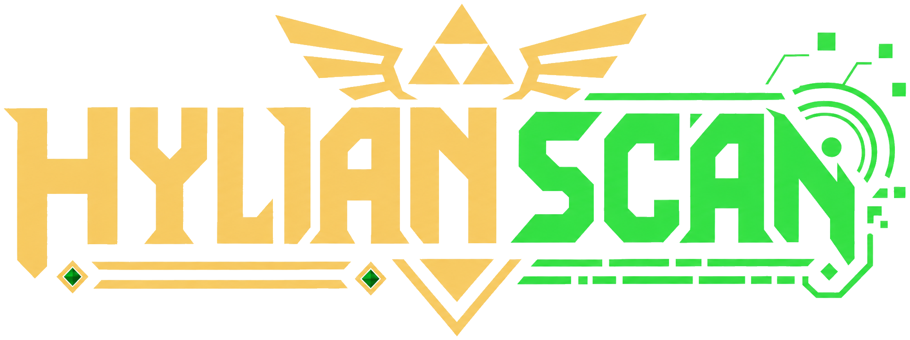
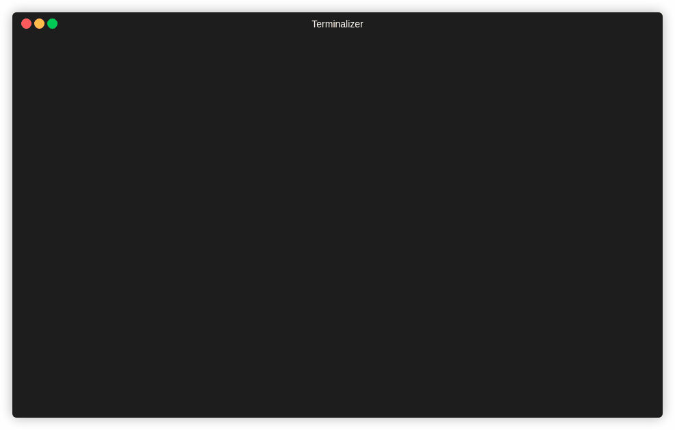

<div align="center">



<br>


</div>

---

# 🛡️ Hylianscan

**Hylianscan** is a fantasy-inspired Python reconnaissance tool built for authorized TCP scanning, protocol-aware probing, passive subdomain discovery, and clean evidence reporting.

It is designed for Kali Linux workflows, security labs, portfolio projects, and practical recon automation.

Hylianscan does not try to be a giant framework.
It focuses on a clean recon loop:

```text
target -> scan or discover -> understand services -> save evidence
```

---

## 👀 What Makes Hylianscan Different?

Most beginner scanners stop at:

```text
80/tcp open
443/tcp open
```

Hylianscan tries to go further.

It can probe services, extract useful protocol metadata, organize results, and export TXT/JSON reports that are easier to review later.

| Area                         | What Hylianscan does                                                   |
| ---------------------------- | ---------------------------------------------------------------------- |
| **Protocol-aware TCP recon** | Detects useful service hints instead of only showing open ports.       |
| **Passive discovery**        | Runs Subfinder, Amass, or both, then merges and deduplicates results.  |
| **Clean reporting**          | Saves target-specific TXT/JSON evidence into organized output folders. |
| **Terminal-first workflow**  | Built to feel good inside Kali/Linux terminals without heavy setup.    |
| **Source-run simplicity**    | Runs directly with Python from the repository.                         |

---

## 🧠 Engineering Focus

Hylianscan was built as a practical security-tooling project focused on:

* Python CLI architecture.
* TCP networking fundamentals.
* Protocol-aware service probing.
* Passive provider orchestration.
* TXT/JSON evidence generation.
* Modular standard-library code.
* Testable scanner, parser, output, and reporting components.

The goal is not only to scan targets, but to show how a recon tool can be structured, tested, and presented like a real project.

---

## 🎞️ Showcase

### 🧪 Protocol-Aware Probing

Hylianscan scans selected TCP ports and then probes open services for useful evidence such as SSH banners, HTTP status codes, headers, content types, TLS details, and web hints.



```bash
python3 hylianscan.py -u scanme.nmap.org -p 20-25,53,80,110,143,443,587,993,995,8080,8443,9000,9090 --max-rate 3
```

---

### 🗺️ Passive Discovery

Passive Discovery can run **Subfinder**, **Amass**, or both providers in the same workflow.

Hylianscan keeps provider activity visible, counts raw discoveries, removes duplicates, and writes the final subdomain map to disk.


```bash
python3 hylianscan.py example.com --subfinder --amass -o --json-output
```

```text
========================================================================
[+] SHEIKAH MAP UPDATED
[+] Target Realm       : example.com
[+] Raw Discoveries    : 20
[+] Unique Subdomains  : 16
[+] Slate Database     : output/example.com/<timestamp>/subdomains.txt
========================================================================
```

---

### 📁 Clean Reporting

Hylianscan can save terminal findings into clean TXT and JSON reports.

This makes it easier to keep evidence, compare scans, and reuse results in later automation.


```bash
python3 hylianscan.py -u scanme.nmap.org -p 22,80,443 -o --json-output
```

---

## 🧬 Features

### 🕵️ TCP Recon

* Domain and IPv4 target support.
* Custom port lists, ranges, top-port presets, and full TCP range support.
* Multi-threaded TCP scanning.
* Optional pacing with `--max-rate`.
* Protocol-aware probes for common services.
* HTTP status, header, content-type, and URL hints.
* STARTTLS/STLS/AUTH TLS upgrade checks for supported services.
* TLS certificate metadata for implicit TLS services.
* Passive banner fallback for unknown services.
* Clean final terminal panel.
* TXT and JSON exports.
* Quiet mode for automation.

### 🗺️ Passive Discovery

* Subfinder support.
* Amass support.
* Provider path overrides with `--subfinder-path` and `--amass-path`.
* Provider-aware terminal activity.
* Raw discovery counts.
* Unique subdomain counts.
* Deduplicated and sorted output.
* TXT and JSON export.
* Clean relative output paths.

### 📁 Reporting

* Target-specific timestamped workspaces.
* Human-readable TXT reports.
* Structured JSON output.
* Compact terminal summaries.
* Automation-friendly quiet mode.

### Optional Nmap Enrichment

* Runs Nmap service/version enrichment only when `--nmap` is provided.
* Hylianscan performs the native TCP scan first.
* Nmap runs only against TCP ports already found open by Hylianscan.
* Nmap must be installed separately.
* Enrichment is printed to the terminal only in this milestone.

### Nmap XML Import

* Imports an existing Nmap XML file with `--nmap-xml`.
* Does not run Nmap.
* Does not require Nmap to be installed.
* Does not perform live scanning.
* Supports TXT and JSON export with `-o` and `--json-output`.

---

## 📦 Installation

Recommended CLI install with `pipx`:

```bash
pipx install git+https://github.com/gArCiAcyber/Network_scan.git
hylianscan --help
```

Alternative source-run workflow:

```bash
git clone https://github.com/gArCiAcyber/Network_scan.git
cd Network_scan
python3 hylianscan.py --help
```

Hylianscan uses the Python standard library for its core execution.

For Passive Discovery, install Subfinder and/or Amass separately and keep them available in your `PATH`, or pass explicit paths with `--subfinder-path` and `--amass-path`.

For optional live Nmap enrichment, install Nmap separately and keep it available in your `PATH`, or pass an explicit path with `--nmap-path`.

---

## 🤔 TCP Usage

```bash
# Basic scan
python3 hylianscan.py scanme.nmap.org

# Custom ports
python3 hylianscan.py -u scanme.nmap.org -p 22,80,443

# Controlled paced scan
python3 hylianscan.py -u scanme.nmap.org -p 20-25,53,80,110,143,443,587,993,995,8080,8443,9000,9090 --max-rate 3

# Save TXT and JSON reports
python3 hylianscan.py -u scanme.nmap.org -p 22,80,443 -o --json-output
```

### Optional Live Nmap Enrichment

Use `--nmap` when you want Hylianscan to scan first, then ask Nmap for service/version enrichment only on ports Hylianscan already found open.

```bash
python3 hylianscan.py scanme.nmap.org -p 22,80,443 --nmap
python3 hylianscan.py scanme.nmap.org -p 22,80,443 --nmap --nmap-path /usr/bin/nmap
```

This does not replace Hylianscan's native TCP scan and does not save Nmap enrichment into TXT/JSON reports yet.

---

## 🗺️ Passive Discovery Usage

```bash
# Subfinder only
python3 hylianscan.py example.com --subfinder

# Amass only
python3 hylianscan.py example.com --amass

# Subfinder + Amass with TXT/JSON output
python3 hylianscan.py example.com --subfinder --amass -o --json-output
```

---

## Nmap XML Import

Use this mode to review an existing Nmap XML result without running Nmap or starting a live scan.

```bash
python3 hylianscan.py --nmap-xml nmap-results.xml
python3 hylianscan.py --nmap-xml nmap-results.xml -o --json-output
```

The import currently supports a single up host and open TCP ports from the XML file. When output is enabled, Hylianscan saves `nmap_import_report.txt` and `nmap_import_results.json`.

---

## 🚪 Port Profiles

Hylianscan includes predefined profiles for common authorized recon workflows.

| Profile     | Alias      | Purpose                             |
| ----------- | ---------- | ----------------------------------- |
| `quick`     | `kokiri`   | Small first-contact scan.           |
| `web`       | `sheikah`  | Web-focused recon ports.            |
| `mail`      | `rito`     | Mail and STARTTLS-related services. |
| `admin`     | `castle`   | Common admin and management ports.  |
| `bugbounty` | `triforce` | Broader authorized recon profile.   |

```bash
python3 hylianscan.py --list-port-profiles
python3 hylianscan.py scanme.nmap.org --port-profile web
python3 hylianscan.py scanme.nmap.org --port-profile sheikah
```

---

## 🛡️ Scan Stances

Scan stances control the balance between speed and caution.

| Stance       | Alias    | Behavior                          |
| ------------ | -------- | --------------------------------- |
| `fast`       | `din`    | Faster scanning defaults.         |
| `balanced`   | `nayru`  | Default balanced behavior.        |
| `stealthier` | `farore` | Slower and more cautious probing. |

```bash
python3 hylianscan.py --list-stances
python3 hylianscan.py scanme.nmap.org --stance balanced
python3 hylianscan.py scanme.nmap.org -p 1-1000 -t 100 -T 1.0 --max-rate 50
```

---

## 📁 Output

When output is enabled, Hylianscan creates organized workspaces:

```text
output/<target>/<timestamp>/
```

Common files:

```text
tcp_report.txt
tcp_results.json
subdomains.txt
subdomains.json
nmap_import_report.txt
nmap_import_results.json
```

TXT output is designed for quick reading.
JSON output is designed for automation, parsing, evidence tracking, and later tooling.

---

## 🧪 Testing

```bash
python3 -m unittest discover -s tests -p "test_*.py" -v
python3 -m compileall -q hylianscan.py core modules tests
python3 hylianscan.py --help
```

---

## ❗ Notes

* TCP scanning and Passive Discovery are separate modes.
* Passive Discovery requires Subfinder and/or Amass.
* Full-range TCP scans should only be used in authorized environments.
* Demo commands should be treated as examples, not permission to scan public systems.
* The tool is intended for labs, learning, legitimate recon, and authorized security work.

---

## ⚠️ Be Safe

Hylianscan is a reconnaissance tool.

Keep your scans scoped.
Keep your evidence organized.
Only test what you are allowed to test.

**Authorized targets only.**
