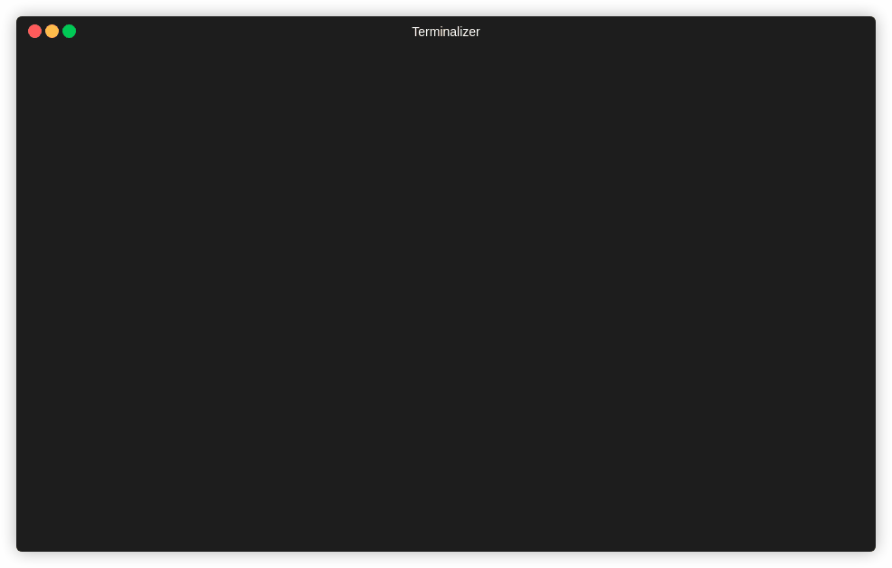

<div align="center">


<br>


</div>

---

# 🛡️ Hylianscan

**Hylianscan** is a fantasy-inspired Python reconnaissance tool built for authorized TCP scanning, protocol-aware probing, passive subdomain discovery, HTTPx web fingerprinting, and clean evidence reporting.

It is designed for Kali Linux workflows, security labs, portfolio projects, and practical recon automation.

Hylianscan does not try to be a giant framework.
It focuses on a clean recon loop:

```text
target -> scan or discover -> understand services -> save evidence
```

---

## 👀 What Makes Hylianscan Different?

Most beginner scanners stop at:

```text
80/tcp open
443/tcp open
```

Hylianscan tries to go further.

It can probe services, extract useful protocol metadata, organize results, and export TXT/JSON reports that are easier to review later.

| Area                         | What Hylianscan does                                                   |
| ---------------------------- | ---------------------------------------------------------------------- |
| **Protocol-aware TCP recon** | Detects useful service hints instead of only showing open ports.       |
| **Passive discovery**        | Runs Subfinder/Amass, optionally validates candidates with DNSx, then deduplicates results. |
| **Clean reporting**          | Saves target-specific TXT/JSON evidence into organized output folders. |
| **Terminal-first workflow**  | Built to feel good inside Kali/Linux terminals without heavy setup.    |
| **Source-run simplicity**    | Runs directly with Python from the repository.                         |

---

## 🧠 Engineering Focus

Hylianscan was built as a practical security-tooling project focused on:

* Python CLI architecture.
* TCP networking fundamentals.
* Protocol-aware service probing.
* Passive provider orchestration.
* TXT/JSON evidence generation.
* Modular standard-library code.
* Testable scanner, parser, output, and reporting components.

The goal is not only to scan targets, but to show how a recon tool can be structured, tested, and presented like a real project.

---

## 🎞️ Showcase

### 🧪 Protocol-Aware Probing

Hylianscan scans selected TCP ports and then probes open services for useful evidence such as SSH banners, HTTP status codes, headers, content types, TLS details, and web hints.



```bash
python3 hylianscan.py -u scanme.nmap.org -p 20-25,53,80,110,143,443,587,993,995,8080,8443,9000,9090 --max-rate 3
```

---

### 🗺️ Passive Discovery

Passive Discovery can run **Subfinder**, **Amass**, or both providers in the same workflow. Add **DNSx** to keep only candidates with A and/or AAAA address records.

Hylianscan keeps provider activity visible, counts raw discoveries, removes duplicates, and writes the final subdomain map to disk.


```bash
python3 hylianscan.py example.com --subfinder --amass -o --json-output
```

```bash
# Discover candidates, confirm A and AAAA records with DNSx, and export the results
python3 hylianscan.py example.com --subfinder --amass --dnsx -o --json-output
```

```text
========================================================================
[+] SHEIKAH MAP UPDATED
[+] Target Realm       : example.com
[+] Raw Discoveries    : 20
[+] Unique Subdomains  : 16
[+] Slate Database     : output/example.com/<timestamp>/subdomains.txt
========================================================================
```

---

### 📁 Clean Reporting

Hylianscan can save terminal findings into clean TXT and JSON reports.

This makes it easier to keep evidence, compare scans, and reuse results in later automation.


```bash
python3 hylianscan.py -u scanme.nmap.org -p 22,80,443 -o --json-output
```

---

## 🧬 Features

### 🕵️ TCP Recon

* Domain, IPv4, IPv6, and dual-stack target support.
* Explicit `--ipv4`, `--ipv6`, and `--dual-stack` resolution modes.
* Resolver-provided IPv4/IPv6 separation and reverse-DNS metadata.
* Optional TCP or ICMP host discovery with `--host-discovery tcp|icmp`.
* Complete `quick`, `web`, and `cautious` scan profiles.
* Custom port lists, ranges, top-port presets, and full TCP range support.
* Multi-threaded TCP scanning.
* Optional pacing with `--max-rate`.
* Protocol-aware probes for common services.
* HTTP status, header, content-type, and URL hints.
* STARTTLS/STLS/AUTH TLS upgrade checks for supported services.
* TLS certificate metadata for implicit TLS services.
* Passive banner fallback for unknown services.
* Clean final terminal panel.
* TXT and JSON exports.
* Quiet mode for automation.

### 🗺️ Passive Discovery

* Subfinder support.
* Amass support.
* DNSx A/AAAA resolution with IPv4, IPv6, and dual-stack selection.
* DNSx resolver, concurrency, rate-limit, timeout, retry, and automatic wildcard controls.
* Provider path overrides with `--subfinder-path`, `--amass-path`, `--dnsx-path`, and `--httpx-path`.
* Optional HTTPx probing of the root domain and final deduplicated discoveries.
* Provider-aware terminal activity.
* Raw discovery counts.
* Unique subdomain counts.
* Deduplicated and sorted output.
* TXT and JSON export.
* Clean relative output paths.

### 📁 Reporting

* Target-specific timestamped workspaces.
* Human-readable TXT reports.
* Structured JSON output.
* Compact terminal summaries.
* Automation-friendly quiet mode.

### Optional Nmap Enrichment

* Runs Nmap service/version enrichment only when `--nmap` is provided.
* Hylianscan performs the native TCP scan first.
* Nmap runs only against TCP ports already found open by Hylianscan.
* Nmap must be installed separately.
* Enrichment is printed to the terminal and included in saved TXT/JSON reports when `-o` and/or `--json-output` are used.

### Optional HTTPx Web Probing

* Runs ProjectDiscovery HTTPx after passive discovery and optional DNSx filtering when `--httpx` is provided.
* Probes both HTTP and HTTPS and collects status, title, technologies, server, IP, CNAME, and redirect location.
* Saves the raw structured findings as `httpx.jsonl` and embeds them in the passive JSON report.
* HTTPx must be installed separately or selected with `--httpx-path`.

### Nmap XML Import

* Imports an existing Nmap XML file with `--nmap-xml`.
* Does not run Nmap.
* Does not require Nmap to be installed.
* Does not perform live scanning.
* Supports TXT and JSON export with `-o` and `--json-output`.

---

## 📦 Installation

Recommended CLI install with `pipx`:

```bash
pipx install git+https://github.com/gArCiAcyber/Network_scan.git
hylianscan --help
```

Alternative source-run workflow:

```bash
git clone https://github.com/gArCiAcyber/Network_scan.git
cd Network_scan
python3 hylianscan.py --help
```

Hylianscan uses the Python standard library for its core execution.

For Passive Discovery, install Subfinder and/or Amass separately and keep them available in your `PATH`, or pass explicit paths with `--subfinder-path` and `--amass-path`. DNSx is optional and can be enabled with `--dnsx`.

For optional live web fingerprinting, install ProjectDiscovery HTTPx separately and keep it available in your `PATH`, or pass an explicit path with `--httpx-path`.

For optional live Nmap enrichment, install Nmap separately and keep it available in your `PATH`, or pass an explicit path with `--nmap-path`.

---

## 🤔 TCP Usage

```bash
# Basic scan
python3 hylianscan.py scanme.nmap.org

# Custom ports
python3 hylianscan.py -u scanme.nmap.org -p 22,80,443

# Controlled paced scan
python3 hylianscan.py -u scanme.nmap.org -p 20-25,53,80,110,143,443,587,993,995,8080,8443,9000,9090 --max-rate 3

# Save TXT and JSON reports
python3 hylianscan.py -u scanme.nmap.org -p 22,80,443 -o --json-output

# IPv6-only or dual-stack scans
python3 hylianscan.py -u 2001:db8::10 --ipv6 -p 80,443
python3 hylianscan.py -u example.com --dual-stack -p 80,443

# Optional host reachability preflight
python3 hylianscan.py -u example.com --host-discovery tcp -p 80,443
```

### Optional Live Nmap Enrichment

Use `--nmap` when you want Hylianscan to scan first, then ask Nmap for service/version enrichment only on ports Hylianscan already found open.

```bash
python3 hylianscan.py scanme.nmap.org -p 22,80,443 --nmap
python3 hylianscan.py scanme.nmap.org -p 22,80,443 --nmap --nmap-path /usr/bin/nmap
python3 hylianscan.py scanme.nmap.org -p 22,80,443 --nmap -o --json-output
```

This does not replace Hylianscan's native TCP scan. When report output is enabled, the saved TXT and JSON reports include the optional Nmap enrichment evidence.

---

## 🗺️ Passive Discovery Usage

```bash
# Subfinder only
python3 hylianscan.py example.com --subfinder

# Amass only
python3 hylianscan.py example.com --amass

# Subfinder + Amass with TXT/JSON output
python3 hylianscan.py example.com --subfinder --amass -o --json-output

# Subfinder + Amass, filtered to subdomains with A or AAAA records
python3 hylianscan.py example.com --subfinder --amass --dnsx -o --json-output

# Separate process budgets (seconds); DNS query timeout remains independent
python3 hylianscan.py example.com -s -a --dnsx --subfinder-timeout 180 --amass-timeout 180 --dnsx-process-timeout 180 --dnsx-timeout 3 --json-output

# IPv6-only DNSx resolution with operational controls
python3 hylianscan.py example.com --subfinder --dnsx --ipv6 --dnsx-resolver resolvers.txt --dnsx-threads 50 --dnsx-rate-limit 100 --dnsx-timeout 3 --dnsx-retry 2 --dnsx-auto-wildcard

# Keep DNSx JSONL record metadata in the JSON report
python3 hylianscan.py example.com --subfinder --dnsx --dnsx-json --json-output

# Subfinder + Amass followed by HTTPx (reserved fake target)
python3 hylianscan.py example.test --subfinder --amass --httpx -o --json-output

# Use an explicit HTTPx executable
python3 hylianscan.py example.test --subfinder --httpx --httpx-path /usr/local/bin/httpx --json-output
```

DNSx uses both A and AAAA records by default. Use `--ipv4` for A records only or `--ipv6` for AAAA records only. DNSx confirms address records; it does not prove that an application service is reachable.

In JSON reports, `results.candidates` contains the deduplicated Subfinder/Amass discovery evidence, while `results.resolution` records DNSx's status and the final address-record-confirmed subdomains. The existing `results.subdomains` and `results.sources` fields remain available for compatibility.

All selected Subfinder, Amass, and DNSx executables (including explicit path overrides) are checked before discovery starts. A missing or invalid executable stops the CLI with exit status 1 before any provider runs. DNSx is checked even when discovery would produce no candidates; unselected tools are not required.

Local version/help checks warn when a version is unsupported or cannot be verified, then allow discovery to continue. Missing required CLI options still stop before enumeration. JSON provider entries record the observed version and compatibility status. The packaged registry and daily release-monitoring workflow are described in [External provider compatibility](docs/provider_compatibility.md), including tested baselines, automatic Ubuntu/Windows checks, classifications, and registry update proposals.

Providers run sequentially with a default process budget of 180 seconds each, followed by bounded cleanup. `--subfinder-timeout`, `--amass-timeout`, and `--dnsx-process-timeout` accept finite positive seconds. Each budget includes its startup compatibility checks (up to 10 seconds); Amass also retains its bounded execution-time version check. `--dnsx-timeout` controls an individual DNS query; `--timeout` is for TCP scanning. A timed-out enumeration returns partial results and the CLI exits with status 1 after saving reports.

Amass 3.x hostname output and 4.x graph output are supported; graph parsing is tested against the 4.2.0 format. Amass 5.0.0 uses its local engine and reads names from a temporary graph database via `subs -names`. Hylianscan stops an engine it starts, preserves partial names on timeout, and rejects Amass configurations that enable active enumeration. On Windows, Amass 5.0.0 engine logs are captured from stdout to avoid its invalid log filename. Other 5.x versions warn as untested. Discovery candidates must be valid DNS hostnames within the requested domain before reaching DNSx.

After each discovery provider, Hylianscan saves a checkpoint. With DNSx enabled, `subdomains_candidates.txt` beside `subdomains.txt` preserves the discovery names; `subdomains.txt` contains only names confirmed by DNSx, and may be empty before resolution. For other TXT filenames, the candidate file uses `<stem>_candidates.txt`. Ctrl+C saves available evidence, marks the active provider `interrupted` in optional JSON, and exits with status 130.

Progress shows provider elapsed time, budget, candidate count, and completion status. Upstream diagnostics are distinct from process timeouts. The last 20 stderr lines per provider (up to 2,000 characters each, terminal escapes removed) are saved in `<stem>_providers.log` and optional JSON; JSON also includes measured `elapsed_seconds` when available. Provider output is temporarily spooled to disk, so input and inherited output pipes cannot hold the runner open. POSIX cleanup stops the owned process group; Windows uses bounded process-tree termination while the parent is running. Detached services are not managed by this workflow.

---

## Nmap XML Import

Use this mode to review an existing Nmap XML result without running Nmap or starting a live scan.

```bash
python3 hylianscan.py --nmap-xml docs/examples/nmap_single_host.xml
python3 hylianscan.py --nmap-xml docs/examples/nmap_single_host.xml -o --json-output
```

The import currently supports a single up host and open TCP ports from the XML file. When output is enabled, Hylianscan saves `nmap_import_report.txt` and `nmap_import_results.json`.

---

## Complete Scan Profiles

Use one profile to select the port scope and operational defaults together.

| Profile    | Ports                     | Workers | Timeout | Max rate  | Discovery           | HTTP probing |
| ---------- | ------------------------- | ------- | ------- | --------- | ------------------- | ------------ |
| `quick`    | Common (`quick`)          | 50      | 0.75s   | Unlimited | Disabled by default | Disabled     |
| `web`      | Web (`web`)               | 50      | 1.00s   | Unlimited | Disabled by default | Enabled      |
| `cautious` | Selected common (`quick`) | 10      | 2.00s   | 10/s      | Optional            | Enabled      |

```bash
python3 hylianscan.py --list-profiles
python3 hylianscan.py scanme.nmap.org --profile quick
python3 hylianscan.py scanme.nmap.org --profile web
python3 hylianscan.py scanme.nmap.org --profile cautious --host-discovery tcp
```

Explicit port, stance, thread, timeout, rate, discovery, and HTTP-probing flags override the corresponding profile defaults.

---

## 🚪 Port Profiles

Hylianscan includes predefined profiles for common authorized recon workflows.

| Profile     | Alias      | Purpose                             |
| ----------- | ---------- | ----------------------------------- |
| `quick`     | `kokiri`   | Small first-contact scan.           |
| `web`       | `sheikah`  | Web-focused recon ports.            |
| `mail`      | `rito`     | Mail and STARTTLS-related services. |
| `admin`     | `castle`   | Common admin and management ports.  |
| `bugbounty` | `triforce` | Broader authorized recon profile.   |

```bash
python3 hylianscan.py --list-port-profiles
python3 hylianscan.py scanme.nmap.org --port-profile web
python3 hylianscan.py scanme.nmap.org --port-profile sheikah
```

---

## 🛡️ Scan Stances

Scan stances control the balance between speed and caution.

| Stance       | Alias    | Behavior                          |
| ------------ | -------- | --------------------------------- |
| `fast`       | `din`    | Faster scanning defaults.         |
| `balanced`   | `nayru`  | Default balanced behavior.        |
| `stealthier` | `farore` | Slower and more cautious probing. |

```bash
python3 hylianscan.py --list-stances
python3 hylianscan.py scanme.nmap.org --stance balanced
python3 hylianscan.py scanme.nmap.org -p 1-1000 -t 100 -T 1.0 --max-rate 50
```

---

## 📁 Output

When output is enabled, Hylianscan creates organized workspaces:

```text
output/<target>/<timestamp>/
```

Common files:

```text
tcp_report.txt
tcp_results.json
subdomains.txt
subdomains.json
httpx.jsonl
nmap_import_report.txt
nmap_import_results.json
```

TXT output is designed for quick reading.
JSON output is designed for automation, parsing, evidence tracking, and later tooling.

---

## 🧪 Testing

```bash
python3 -m unittest discover -s tests -p "test_*.py" -v
python3 -m compileall -q hylianscan.py core modules tests
python3 hylianscan.py --help
```

---

## ❗ Notes

* TCP scanning and Passive Discovery are separate modes.
* Passive Discovery requires Subfinder and/or Amass; DNSx is an optional resolver stage.
* Full-range TCP scans should only be used in authorized environments.
* Demo commands should be treated as examples, not permission to scan public systems.
* The tool is intended for labs, learning, legitimate recon, and authorized security work.

---

## ⚠️ Be Safe

Hylianscan is a reconnaissance tool.

Keep your scans scoped.
Keep your evidence organized.
Only test what you are allowed to test.

**Authorized targets only.**
